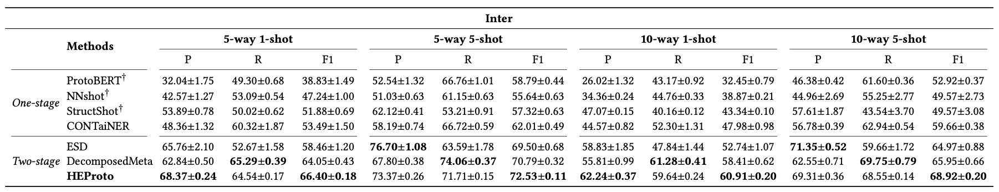
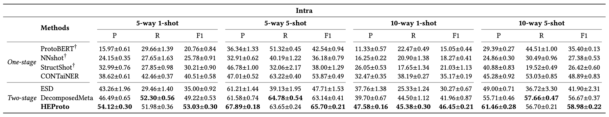

# HEProto
 &nbsp;

The source code for paper:

[HEProto: A Hierarchical Enhancing ProtoNet based on Multi-Task Learning for Few-shot Named Entity Recognition](https://dl.acm.org/doi/abs/10.1145/3583780.3614908)  (full paper of CIKM '23)

If you find our work useful for your research, please cite the following paper:

    @inproceedings{chen2023heproto,
      author       = {Wei Chen and
                      Lili Zhao and
                      Pengfei Luo and
                      Tong Xu and
                      Yi Zheng and
                      Enhong Chen},
      title        = {HEProto: {A} Hierarchical Enhancing ProtoNet based on Multi-Task Learning
                      for Few-shot Named Entity Recognition},
      booktitle    = {{CIKM}},
      pages        = {296--305},
      publisher    = {{ACM}},
      year         = {2023}
    }

# Overview

    

# File Structure
    -HEProto
        -data
        -dataset
        -debug
        -outputs
        -scripts
        ...

# Dataset
We use the ***[Few-NERD](https://github.com/thunlp/Few-NERD) Arxiv V6 Version*** dataset, which you can download from the [website](https://ningding97.github.io/fewnerd/) (Sampled Datasets) and put in the <code>./dataset</code> directory.

# Quick Start
## Train
    bash script/run.sh

## Eval
    bash script/pred.sh

# Results
## Few-NERD (Inter)

    

## Few-NERD (Intra)

    

# Acknowledge
Our code is based on [DecomposedMetaNER](https://github.com/microsoft/vert-papers/tree/master/papers/DecomposedMetaNER), thanks very much for their great work!

